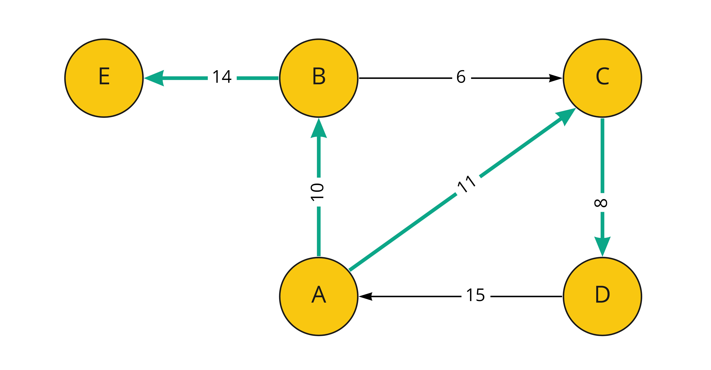

[](https://classroom.github.com/online_ide?assignment_repo_id=6958497&assignment_repo_type=AssignmentRepo)
# Algoritmos y Estructura de Datos
## Proyecto sobre Grafos
--------

## Integrantes
- Elmer Escandón
- Claudia Pacori

----

El proyecto del curso consiste en implementar una estructura de datos de grafo y un file parser. La estructura debe soportar los métodos y algoritmos descritos a continuacion:  


## Graph data structure

Se creó una clase padre con métodos virtuales que permitireron implementar el Directed y Undirected Graphs. Para ello, se definieron los structs:

* Vertex: Incluye un string id con el que se identificará el vértice, la data de tipo TV y una lista con los edges a los que está conectado.

* Edge: Incluye el weight de la arista de tipo TE y un puntero a los vertexes que une.

Además, el grafo contiene un unordered map con los vértices que lo contienen.

### Methods:
#### Insert vertex
Crea un vertice en el grafo a partir de un id (string) y la data del vertice (TV).
```cpp
bool insertVertex(string id, TV vertex);
```
#### Create Edge
Crea una arista en el grafo, conectando los grafos con id1 y id2 (strings). Además, asigna el peso w (TE) a esta conexión.
```cpp
bool createEdge(string id1, string id2, TE w);
```
#### Delete Vertex
Borra el vértice identificado con un id específico (string) en el grafo.
```cpp
bool deleteVertex(string id);
```
#### Delete Edge
Borra la arista que conecta a los grafos identificados por el id_inicio y id_final (strings).
```cpp
bool deleteEdge(string id_inicio, string id_final);
```
#### Operator ()
Retorna el peso de la arista que conecta a los grafos identificados por start y end (strings).
```cpp
TE &operator()(string start, string end);
```
#### Density
Calcula la densidad del grafo. Según el tipo de grafo, este método fue implementado de diferente manera en DirectedGraph y UnDirectedGraph.
```cpp
float density();
```
#### Is Dense
Determina si un grafo es denso comparando la densidad de este mismo con un valor threshold (float) que es pasado como argumento y por defecto es 0.5.
```cpp
bool isDense(float threshold = 0.5);
```
#### Is Connected
Verifica si para cada par de vértices del grafo existe al menos un camino. Aplica para ambos tipos DirectedGraph y UnDirectedGraph.
```cpp
bool isConnected();
```
#### Is Strongly Connected
Verifica si para cada par de vértices del grafo existe un camino de ida y vuelta. Aplica únicamente para el tipo DirectedGraph.
```cpp
bool isStronglyConnected();
```
#### Empty
Determina si el grafo tiene vértices que lo compongan o no.
```cpp
bool empty();
```
#### Clear
Vacía el mapa con los vértices que contiene el grafo.
```cpp
void clear();
```
#### Find by ID
Verifica si un vértice, según su id (string), está dentro del unordered map de vértices del grafo.
```cpp
bool findById(string id);
```
#### Display Vertex
Muestra un vértice: su id y hacia qué otros vértices está conectado (id y peso de la arista que los conecta).
```cpp
void displayVertex(string id);
```
#### Display
Recorre todos los vértices del grafo mostrándolos a partir de la función anteriormente descrita.
```cpp
void display();
```

## Algorithms:
Se implementaron y probaron un total de nueve algoritmos los cuales son los siguientes:
### BFS
Descripción
```cpp
BFS<int,int> bfs(graph, "A");
bfs.display();
```


### DFS
Descripción
```cpp
DFS<int,int> dfs(graph, "A");
dfs.apply_search();
dfs.display();
```
### Prim
Descripción
```cpp
Prim<int, int> prim(graph, "A");
UndirectedGraph<int, int> result = prim.apply();
result.display();
```
### Kruskal
Descripción
```cpp
Kruskal<int,int> kruskal(graph);
krus.apply();
UnDirectedGraph<int, int>* graph = krus.kruskal_(krus);
graph->display();
```
### Dijkstra
Descripción
```cpp
Dijkstra<int,int> dijs(graph,"A");
dijs.apply();
dijs.display();
```
### A*
Descripción
```cpp
AStar<int,int> astar(graph,"A","I", vector<int> heuristics);
UndirectedGraph<int, int> result = astar.apply();
result.display();
```
### Greedy BFS
Descripción
```cpp
Greedy<int,int> greedy(graph,"S","E",heuristics);
UndirectedGraph<int, int> result = greedy.apply();
result.display();
```
### Floyd Warshall
Descripción
```cpp
Floyd<int,int> floyd(graph);
floyd.apply();
floyd.display();
```
### Bellman Ford
Descripción
```cpp
Bellman<int,int> bell(graph,"B");
bell.apply();
bell.display();
```

## JSON file parser
Se utilizó la librería [nlohmann::json](https://github.com/nlohmann/json), para poder construir los grados Directed y UnDirected a partir de un archivo JSON de aereopuertos del Perú y el mundo. 
Se implementó una clase parser que tiene como atributos un string con la ruta del archivo y un jsonGraph que almacena el JSON que será accedido más adelante.
```cpp
class Parser{
private:
    string path;                
    json jsonGraph;

public:
    Parser(string path_);

    void clear();

    void readJSON();

    void uGraphMake(UnDirectedGraph<string, double> &tempGraph);

    void dGraphMake(DirectedGraph<string, double> &tempGraph);
};
```

### Methods:
#### Clear
Limpia tanto la ruta del archivo como el objeto json de la clase.
```cpp
void clear(); // Clears parser saved atributes
```
#### Read JSON
Abre el archivo JSON en modo lectura y lleva cada línea a un string, para poder eliminar los corchetes de los datos. Luego se parsea la data a un objeto nlohmann::json.
```cpp
void readJSON(); // Parses JSON file and saves data into class
// NOTE: each derived class has its own readJSON method
```
#### Creador del grafo no dirigido
Recibe un tempGraph el cual será modificado, en primer lugar, creando los vértices con la función insertVertex descrita anteriormente. Nuestro grafo recibe como id el nombre de la ciudad del aeropuerto, lo que hace más fácil la lectura de la información, y un string con la latitud y longitud de este mismo, que serán utilizados para hallar la heurística.
Luego, se crean las aristas conectando cada aeropuerto con sus destinations. Se envían como parámetros al createEdge: el nombre de la ciudad de origen, el nombre de la ciudad de destino y la distancia euclidiana entre ellas (hallada con una función explicada más adelante).
```cpp
void uGraphMake(UndirectedGraph<string, double> &tempGraph); // Adds the parsed data into the specified undirected graph
```
#### Creador del grafo dirigido
De manera similar al grafo no dirigido, se crean los vértices con el nombre de la ciudad del aeropuerto como id y un string con la latitud y longitud de este mismo como data.
Luego, se crean las aristas conectando cada aeropuerto (a partir del nombre de la ciudad que los identifica) con sus destinations incluyendo como peso la distancia euclidiana entre ellos.
```cpp
void dGraphMake(DirectedGraph<string, double> &tempGraph); // Adds the parsed data into the specified directed graph
```

### Funciones de ayuda:
#### Distancia euclidiana
Calcula la distancia euclidiana entre dos latitudes y longitudes. Para ello, convierte estos valores a long doubles y se halla la distancia deducida a partir del teorema de Pitágoras.
```cpp
long double distance(string lat1, string long1, string lat2, string long2);
```
#### Find Airport by ID
Permite encontrar el index de un aeropuerto en el objeto json utilizando solo el Airport ID. Además, la función retorna por defecto el index 15 que corresponde a la ciudad de Lima en caso no exista el destino que se está buscando.
Cabe resaltar que se eliminaron manualmente los códigos [insertar los códigos] de los aeropuertos que los tenían como destination en el archivo JSON. Esto debido a que creaba edges hacia el mismo punto, en el caso de Lima, al no estar ligados a una ciudad en específico.
```cpp
int findByAirportID(json jsonGraph, string id);
```
