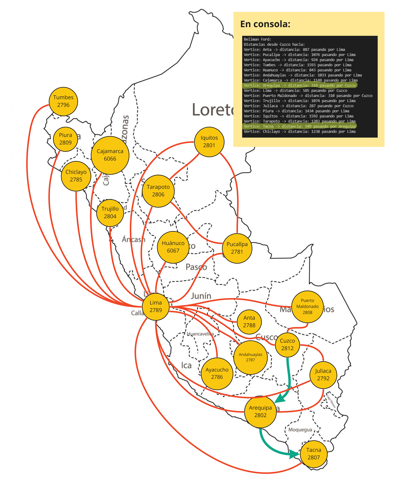

[](https://classroom.github.com/online_ide?assignment_repo_id=6958497&assignment_repo_type=AssignmentRepo)
# Algoritmos y Estructura de Datos
## Proyecto sobre Grafos
--------

## Integrantes
- Elmer Escandón
- Claudia Pacori

----


El proyecto del curso consiste en implementar una estructura de datos de grafo y un file parser. La estructura debe soportar los métodos y algoritmos descritos a continuacion:  


## Graph data structure
-----
Se creó una clase padre con métodos virtuales que permitireron implementar el Directed y Undirected Graphs. Para ello, se definieron los structs:

* Vertex: Incluye un string id con el que se identificará el vértice, la data de tipo TV y una lista con los edges a los que está conectado.

* Edge: Incluye el weight de la arista de tipo TE y un puntero a los vertexes que une.

Además, el grafo contiene un unordered map con los vértices que lo contienen.

### Methods:
#### Insert vertex
Crea un vertice en el grafo a partir de un id (string) y la data del vertice (TV).
```cpp
bool insertVertex(string id, TV vertex);
```
#### Create Edge
Crea una arista en el grafo, conectando los grafos con id1 y id2 (strings). Además, asigna el peso w (TE) a esta conexión.
```cpp
bool createEdge(string id1, string id2, TE w);
```
#### Delete Vertex
Borra el vértice identificado con un id específico (string) en el grafo.
```cpp
bool deleteVertex(string id);
```
#### Delete Edge
Borra la arista que conecta a los grafos identificados por el id_inicio y id_final (strings).
```cpp
bool deleteEdge(string id_inicio, string id_final);
```
#### Operator ()
Retorna el peso de la arista que conecta a los grafos identificados por start y end (strings).
```cpp
TE &operator()(string start, string end);
```
#### Density
Calcula la densidad del grafo. Según el tipo de grafo, este método fue implementado de diferente manera en DirectedGraph y UnDirectedGraph.
```cpp
float density();
```
#### Is Dense
Determina si un grafo es denso comparando la densidad de este mismo con un valor threshold (float) que es pasado como argumento y por defecto es 0.5.
```cpp
bool isDense(float threshold = 0.5);
```
#### Is Connected
Verifica si para cada par de vértices del grafo existe al menos un camino. Aplica para ambos tipos DirectedGraph y UnDirectedGraph.
```cpp
bool isConnected();
```
#### Is Strongly Connected
Verifica si para cada par de vértices del grafo existe un camino de ida y vuelta. Aplica únicamente para el tipo DirectedGraph.
```cpp
bool isStronglyConnected();
```
#### Empty
Determina si el grafo tiene vértices que lo compongan o no.
```cpp
bool empty();
```
#### Clear
Vacía el mapa con los vértices que contiene el grafo.
```cpp
void clear();
```
#### Find by ID
Verifica si un vértice, según su id (string), está dentro del unordered map de vértices del grafo.
```cpp
bool findById(string id);
```
#### Display Vertex
Muestra un vértice: su id y hacia qué otros vértices está conectado (id y peso de la arista que los conecta).
```cpp
void displayVertex(string id);
```
#### Display
Recorre todos los vértices del grafo mostrándolos a partir de la función anteriormente descrita.
```cpp
void display();
```

## Algorithms:
----
Se implementaron y probaron un total de nueve algoritmos los cuales son los siguientes:
> Se incluyen gráficos que para una mejor visualización pueden ser accedidos desde [este hipervínculo](https://miro.com/app/board/o9J_ltHP40Y=/?invite_link_id=828276918578).

### BFS
Se utilizó un unordered_map para guardar la data de los vértices visitados, un queue que almacenará la data de los vértices adyacentes al actual vértice, y un grafo dirigido, el cual se retornará con todos los vértices conectados según sus adyacentes.
```cpp
BFS<int,int> bfs(graph, "A");
bfs.display();
```
Como prueba se incluye el resultado del siguiente grafo de 5 vértices el cual se conecta a partir de "A".

<figure align="center" class="image">
  
</figure>

### DFS
Se utilizó un unordered_map para verificar qué vértices han sido visitados, un stack que almacenará la data de los vértices según se encuentren nuevas conexiones, y un grafo que se retornará con todos los vértices conectados al terminar el algoritmo.
```cpp
DFS<int,int> dfs(graph, "A");
dfs.apply_search();
dfs.display();
```
Como prueba se incluye el resultado del siguiente grafo de 4 vértices el cual se conecta a partir de "A".

<figure align="center" class="image">
  
</figure>

### Prim
El algoritmo de Prim funciona únicamente para grafos no dirigidos. Se utilizó una función que extrae el id del vértice al que se conecta con un peso mínimo a partir de un unordered_map con todos los pesos. El algoritmo retorna el menor camino posible desde cierto vértice hacia todos los vértices del grafo, indicando los padres de cada uno.
```cpp
Prim<int, int> prim(graph, "A");
UndirectedGraph<int, int> result = prim.apply();
result.display();
```
Como prueba se incluye el MST resultante de aplicar el algoritmo sobre el archivo JSON Perú.

<figure align="center" class="image">
  
</figure>

### Kruskal
El algoritmo de Kruskal funciona únicamente para grafos no dirigidos. Se utilizaron Disjoint Sets, de manera que al iterar por todas las aristas ordenadas se podía comprobar si el vértice al que se conectaba pertenece a un set diferente, realizando llamadas a Find(). Luego, se unían los vértices en el DS (Union by rank) y en el grafo.
```cpp
Kruskal<int,int> kruskal(graph);
krus.apply();
UnDirectedGraph<int, int>* graph = krus.kruskal_(krus);
graph->display();
```
Como prueba se incluye el MST resultante de aplicar el algoritmo sobre el archivo JSON Perú. Comprobamos que es igual al ejecutado con Prim.

<figure align="center" class="image">
  
</figure>

### Dijkstra
Se utilizaron unordered_maps para almacenar las distancias hacia otros vértices (distancia), los id de cada vértice (ids) y los padres por donde debe retornar (parents). El método display muestra las distancias dese cierto start_id hacia todos los demás vértices con su respectivo peso y padre.
```cpp
Dijkstra<int,int> dijs(graph,"A");
dijs.apply();
dijs.display();
```
Como prueba se incluye el camino desde Piura hasta Tacna, resultante de aplicar el algoritmo sobre el archivo JSON Perú. Comprobamos que se debe pasar por el aeropuerto de Lima, con un peso de 1843, para poder llegar a este destino.

<figure align="center" class="image">
  
</figure>

### A*
Se utilizaron unordered_maps para almacenar la heurística según el id del vértice, los padres por donde se debe regresar, una tabla_used marcando la lista cerrada al recorrer los vértices. Asimismo, se recibe un vector con la heurística. Se utilizaron funciones para calcular *"G(n) = F(n) + H(n)"* y extraer el id del vértice al que se conecta con un peso mínimo.
```cpp
AStar<int,int> astar(graph,"A","I", vector<int> heuristics);
UndirectedGraph<int, int> result = astar.apply();
result.display();
```
Como prueba se incluye el camino desde Piura hasta Pucallpa, resultante de aplicar el algoritmo sobre el archivo JSON Perú. Comprobamos que se debe pasar por el aeropuerto de Lima para poder llegar a este destino.

<figure align="center" class="image">
  
</figure>

### Greedy BFS
Funciona de manera similar al algoritmo A-Star. Se utilizaron unordered_maps para almacenar la heurística según el id del vértice, los padres por donde se debe regresar, una tabla_used marcando la lista cerrada al recorrer los vértices. Asimismo, se recibe un vector con la heurística. Se utilizó una función para extraer el id del vértice al que se conecta con un peso mínimo.
```cpp
Greedy<int,int> greedy(graph,"S","E",heuristics);
UndirectedGraph<int, int> result = greedy.apply();
result.display();
```
Como prueba se incluye el camino desde Piura hasta Pucallpa, resultante de aplicar el algoritmo sobre el archivo JSON Perú. Comprobamos que se obtiene el mismo resultado que con el algoritmo A-Star.

<figure align="center" class="image">
  
</figure>

### Floyd Warshall
Se utilizaron matrices para almacenar las distancias hacia todos los vértices y el recorrido que se debe seguir para llegar a ellas. Este algoritmo, a diferencia de Dijkstra, funciona con aristas con pesos negativos. Al imprimir, muestra tanto la matriz de distancias como la de recorridos. Luego, permite conocer el camino más corto desde y hacia cualquier vértice.
```cpp
Floyd<int,int> floyd(graph);
floyd.apply();
floyd.display();
```
Como prueba se incluye el camino desde Cuzco hasta Puerto Maldonado, resultante de aplicar el algoritmo sobre el archivo JSON Perú. Comprobamos que estos vértices están conectados, la distancia entre ellos es de 310.932 y el recorrido sería directo.

<figure align="center" class="image">
  
</figure>

### Bellman Ford
El algoritmo de Bellman Ford funciona únicamente para grafos dirigidos.Se utilizaron unordered_maps para almacenar las distancias hacia otros vértices (distancia), los id de cada vértice (ids) y los padres por donde debe retornar (predecesor). Este algoritmo, a diferencia de Dijkstra, funciona con aristas con pesos negativos. El método display muestra las distancias dese cierto start_id hacia todos los demás vértices con su respectivo peso y padre.
```cpp
Bellman<int,int> bell(graph,"B");
bell.apply();
bell.display();
```
Como prueba se incluye el camino desde Cuzco hasta Tacna, resultante de aplicar el algoritmo sobre el archivo JSON Perú. Comprobamos que se debe pasar por el aeropuerto de Arequipa, con una distancia de 549, para poder llegar a este destino.

<figure align="center" class="image">
  
</figure>


## JSON file parser
----
Se utilizó la librería [nlohmann::json](https://github.com/nlohmann/json), para poder construir los grafos Directed y UnDirected a partir de un archivo JSON de aereopuertos del Perú y el mundo. 
Se implementó una clase parser que tiene como atributos un string con la ruta del archivo y un jsonGraph que almacena el JSON que será accedido más adelante.
```cpp
class Parser{
private:
    string path;                
    json jsonGraph;

public:
    Parser(string path_);

    void clear();

    void readJSON();

    void uGraphMake(UnDirectedGraph<string, double> &tempGraph);

    void dGraphMake(DirectedGraph<string, double> &tempGraph);
};
```

### Methods:
#### Clear
Limpia tanto la ruta del archivo como el objeto json de la clase.
```cpp
void clear(); // Clears parser saved atributes
```
#### Read JSON
Abre el archivo JSON en modo lectura y lleva cada línea a un string, para poder eliminar los corchetes de los datos. Luego se parsea la data a un objeto nlohmann::json.
```cpp
void readJSON(); // Parses JSON file and saves data into class
// NOTE: each derived class has its own readJSON method
```
#### Creador del grafo no dirigido
Recibe un tempGraph el cual será modificado, en primer lugar, creando los vértices con la función insertVertex descrita anteriormente. Nuestro grafo recibe como id el nombre de la ciudad del aeropuerto, lo que hace más fácil la lectura de la información, y un string con la latitud y longitud de este mismo, que serán utilizados para hallar la heurística.
Luego, se crean las aristas conectando cada aeropuerto con sus destinations. Se envían como parámetros al createEdge: el nombre de la ciudad de origen, el nombre de la ciudad de destino y la distancia euclidiana entre ellas (hallada con una función explicada más adelante).
```cpp
void uGraphMake(UndirectedGraph<string, double> &tempGraph); // Adds the parsed data into the specified undirected graph
```
<figure align="center" class="image">
  
</figure>

#### Creador del grafo dirigido
De manera similar al grafo no dirigido, se crean los vértices con el nombre de la ciudad del aeropuerto como id y un string con la latitud y longitud de este mismo como data.
Luego, se crean las aristas conectando cada aeropuerto (a partir del nombre de la ciudad que los identifica) con sus destinations incluyendo como peso la distancia euclidiana entre ellos.
> Se llegó a correr el creador de grafos dirigidos para el archivo airports.json, se adjunta [este video](https://drive.google.com/file/d/13C1FcDUjtnCIi1su_P7yBy0S3gs1MacR/view?usp=sharing) como evidencia de su funcionamiento.

```cpp
void dGraphMake(DirectedGraph<string, double> &tempGraph); // Adds the parsed data into the specified directed graph
```
<figure align="center" class="image">
  
</figure>

### Funciones de ayuda:
#### Distancia euclidiana
Calcula la distancia euclidiana entre dos latitudes y longitudes. Para ello, convierte estos valores a long doubles y se halla la distancia deducida a partir del teorema de Pitágoras.
```cpp
long double distance(string lat1, string long1, string lat2, string long2);
```
#### Find Airport by ID
Permite encontrar el index de un aeropuerto en el objeto json utilizando solo el Airport ID. Además, la función retorna por defecto el index 15 que corresponde a la ciudad de Lima en caso no exista el destino que se está buscando.

Cabe resaltar que se eliminaron manualmente los códigos "2762", "1871", "3670", "3797", "3484", "3576", "2650", "193", "1382", "1824", "2771", "3988", "2651", "2699", "2709", "2851", "2715", "2560", "2564", "2673", "2745", "2816", "2599", "1892", "1762", "1885", "2688", "580", "3533", "1871", "3682", "1229", "2554", "2443", "1852", "1909", "1760", "3494", "3550" y "2802" de los aeropuertos que los tenían como destination en el archivo JSON de Perú. Esto debido a que creaba edges hacia el mismo punto, en el caso de Lima, al no estar ligados a una ciudad en específico.

Por otro lado, se eliminaron manualmente los aeropuertos "5562", "5674" y "5675" en el archivo JSON internacional, ya que en las latitudes tenían letras, por lo que se consideró como data corrupta, y el aeropuerto "1104", pues su única destination era hacia uno de los aeropuertos previamente mencionados.

```cpp
int findByAirportID(json jsonGraph, string id);
```

## Tester
Para poder realizar las pruebas de los grafos, algoritmos y parser se creó la estructura Tester:
```cpp
struct Tester {
    static void executeExamples();
    static void executeParserPeru();
    static void excecuteDirected(Parser Peru);
    static void excecuteUnDirected(Parser Peru);
    static void executeParserInternational();
    static vector<double> create_heuristics(Graph<string, double>* grafo,string to);
    static void astar_test(Graph<string,double>* dir_graph, string from, string to, vector<double> heuristic);
    static void floyd_test(Graph<string,double>* dir_graph);
    static void greedydfs_test(Graph<string,double>* dir_graph, string from, string to, vector<double> heuristic);
    static void dijkstra_test(Graph<string,double>* dir_graph, string from);
    static void bellman_test(DirectedGraph<string,double>* dir_graph, string from);
    static void kruskal_test(UnDirectedGraph<string,double>* dir_graph);
    static void prim_test(UnDirectedGraph<string,double>* dir_graph);
};
```
Esta implementa diferentes funciones que nos permitirán recorrer todo lo implementado en el presente proyecto.
* ***executeExamples*():** Crea un grafo dirigido básico (con 4 vértices y 4 aristas) y ejecuta los métodos que comprueba si el grafo está conectado, fuertemente conectado, es denso, eliminar aristas, eliminar vértices, mostrar el grafo y vaciar el grafo.

* ***executeParserPeru*():** Lee el archivo pe.json y le da a escoger al usuario entre crear un grafo dirigido o no dirigido con esos datos.

* ***excecuteDirected*(Parser Peru):** Crea el grafo dirigido y muestra las opciones para obtener la mejor ruta con los siguientes algoritmos: A-Star, Floyd-Warshall, Greedy BFS, Dijkstra y Bellman Ford. En caso sea necesario, permite ingresar las ciudades de procedencia y destino del viaje.

* ***excecuteUnDirected*(Parser Peru):** Crea el grafo no dirigido y muestra las opciones para obtener la mejor ruta con los siguientes algoritmos: A-Star, Floyd-Warshall, Greedy BFS, Dijkstra, Kruskal y Prim. En caso sea necesario, permite ingresar las ciudades de procedencia y destino del viaje.

* ***executeParserInternacional*():** Lee el archivo airports.json, crea un grafo dirigido con esos datos y los muestra.

Finalmente, para ejecutar el proyecto se debe colocar los siguientes comandos en la consola:
```cpp
g++ main.cpp -o main

./main
```
